# (C# 코딩) **EchoMessenger**

## 개요
- C# 프로그래밍 학습
- 1줄 소개:사용자의 키보드 입력값을 받은 후 `ListBox`에 띄우는 프로그램 
- 사용한 플랫폼: 
  - C#, .NET Windows Forms, Visual Studio, GitHub
- 사용한 컨트롤 :
  - Label , TextBox , Button , ListBox
- 사용한 기술과 구현한 기능 :
 -  Visual Studio를 활용한 UI
 -  String 을 활용하여 사용자 입력 데이터 처리
 -  추가 후 `TextBox`의 내용을 비운 후 다음 텍스트를 받을 준비를 합니다.

## 실행 화면 (과제1)
- 과제1 코드의 실행 스크린샷


- 과제 내용
  - `ListBox`를 중앙에 배치하고 하단에 `TextBox`를 배치하며 기본 UI를 구성함.
  - `TextBox`가 값을 입력받은 후 `Button`을 클릭 시 `ListBox`의 항목(item)으로 추가합니다.
  - 추가 후 `TextBox`의 내용을 비운 후 다음 텍스트를 받을 준비를 합니다.
- 구현 내용과 기능 설명
  -`Label`을 상단에 배치하여 프로그램의 제목을 배치하였습니다.
  - `ListBox`를 활용하여 대화 내용 출력 및 메시지 누적을 표시하였습니다.
  - 입력된 메시지를 `ListBox`안에 그대로 적용되도록 기능을 구현하였습니다

## 실행 화면 (과제2)
- 과제2 코드의 실행 스크린샷


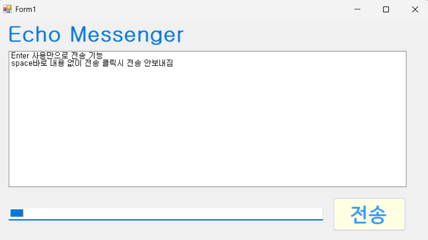
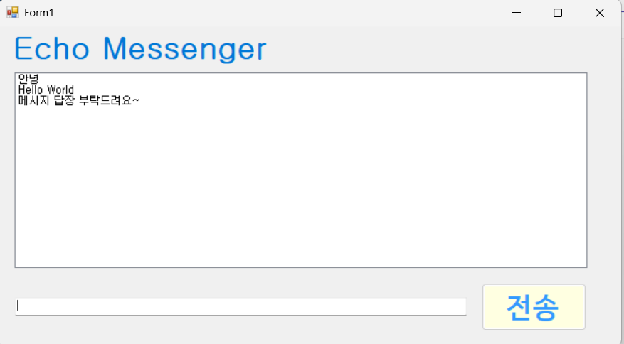
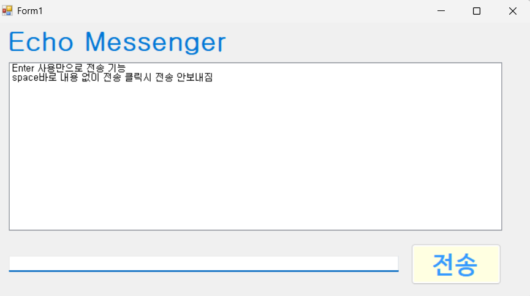

- 과제 내용
  - `TextBox`에서 Enter키 만으로도 `ListBox`에 내용이 나오도록 기능을 구현하였습니다.
  - 공백 내용 작성시 전송버튼을 클릭하여도 `ListBox`에 출력되지 않도록 하였습니다.
  - 전송후에 마우스로 입력창을 다시 클릭하지 않아도 되도록 커서를 자동으로 입력창에 둡니다.

- 구현 내용과 기능 설명
  - ```csharp
    if (e.KeyCode == Keys.Return)
    코드를 이용하여 마우스로 버튼 클릭없이 Enter만으로도 메시지 출력 
  - ```csharp
    if (string.IsNullOrWhiteSpace(typed_msg))
    코드를 이용하여 공백 입력을 방지하는 코드를 삽입하였습니다.

## 실행 화면 (과제3)
- 과제3 코드의 실행 스크린샷

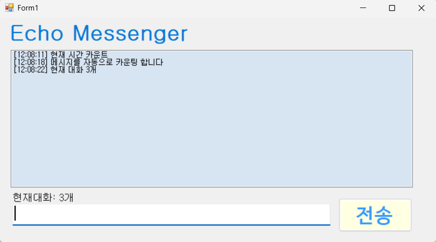
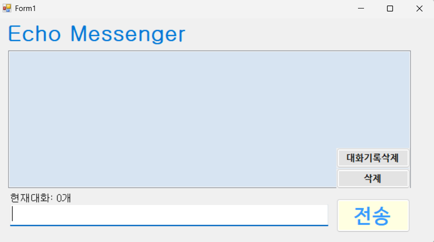
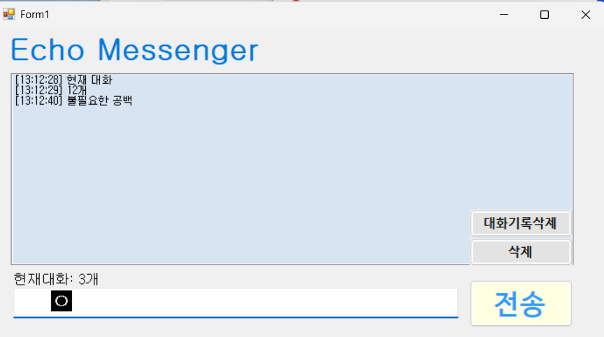
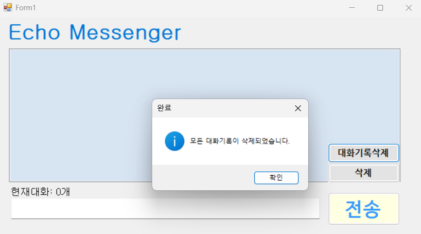

- 과제 내용
 - 메시지 앞에 현재시간([14:20:05])을 자동으로 결합하여 리스트에 출력합니다.
 - 현재 리스트에 쌓인 총 메시지 개수를 계산하여 하단 `Label` 에 실시간으로 업데이트 합니다.
 - 사용자가 입력한 메시지의 앞 뒤 불필요한 공백을 Trim() 함수로 제거하여 저장합니다

- 구현 내용과 기능 설명
  - DataTime을 활용하여 메세지 앞에 타임스탬프를 자동으로 추가하도록 구현했습니다.
  - ListBox에 저장된 메시지 개수를 기반으로 Label에 현재 대화 개수를 계산하였습니다.
  - Trim() 함수를 사용하여 입력된 문자열의 앞뒤 공백을 제거하였습니다.
 
 ## 실행 화면 (과제4)
- 과제4 코드의 실행 스크린샷

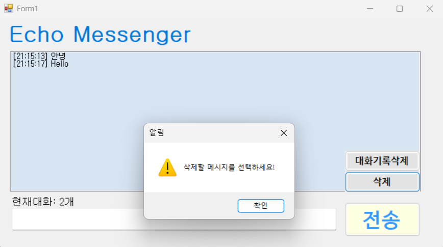
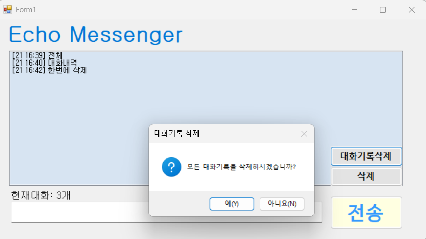
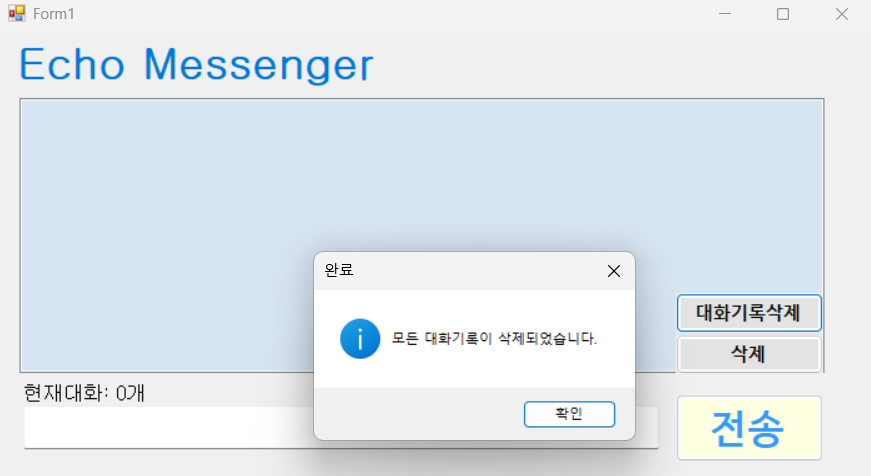
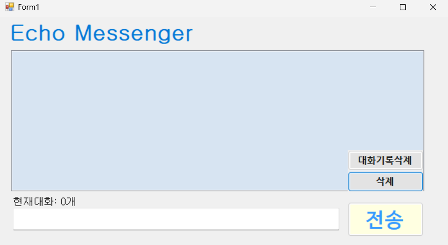


- 과제 내용
 - 선택된 항목을 삭제하는 기능을 구현하였습니다.
 - 전체 대화내용을 초기화하는 기능을 구현하였습니다.
 - 글자 수 제한 내용을 구현하는 기능을 제작중입니다.

- 구현 내용과 기능 설명
  - ListBox에서 선택된 메시지를 삭제 버튼을 통해 제거할 수 있도록 구현하였으며, 선택되지 않은 상태에서 삭제 시 경고 메시지를 출력하도록 예외 처리를 추가하였습니다.
  - RemoveAt() 메서드를 활용하여 선택된 항목만 삭제하고, 삭제 이후에도 현재 메시지 개수를 Label에 반영하도록 구성하였습니다.
  - 대화기록삭제 버튼 클릭 시 확인 대화상자를 통해 사용자 동의를 받은 후 ListBox의 모든 항목을 Clear()로 초기화하도록 구현하였습니다.
